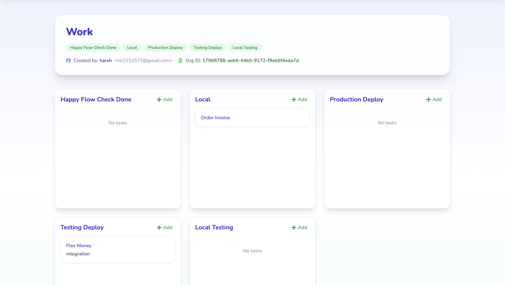

# Kanban Pro

A modern, full-stack Kanban board application built with **Java Spring Boot** (backend) and **Next.js + Tailwind CSS** (frontend).

Kanban Pro helps teams organize tasks, track progress, and collaborate efficiently with a beautiful, responsive UI and a robust backend.

---

## 🚀 Features

- User Authentication (JWT, OAuth, or session-based)
- Organization & Team Management
- Multiple Boards & Lists
- Drag-and-drop Task Cards
- Real-time Updates (WebSockets/Server-Sent Events)
- Activity Tracking & Notifications
- Responsive Design (Mobile & Desktop)
- Profile Management
- Role-based Access Control
- Beautiful UI with Tailwind CSS

---

## 🏗️ Project Structure

kanban-pro/
├── backend/ # Java Spring Boot REST API
│ ├── src/
│ ├── pom.xml
│ └── ...
├── frontend/ # Next.js + Tailwind CSS app
│ ├── app/
│ ├── components/
│ ├── tailwind.config.js
│ ├── package.json
│ └── ...
└── README.md


---

## ⚙️ Tech Stack

| Layer      | Technology                |
|------------|---------------------------|
| Backend    | Java 17+, Spring Boot, Spring Security, JPA/Hibernate, PostgreSQL/MySQL |
| Frontend   | Next.js (React), Tailwind CSS, React DnD/SortableJS, SWR/React Query   |
| Auth       | JWT/OAuth2/Spring Security |
| API Comm   | REST (JSON), WebSockets (optional) |
| Dev Tools  | Docker, Maven, ESLint, Prettier, Husky (optional) |

---

## 🛠️ Getting Started

### 1. Clone the Repository

git clone https://github.com/harshk461/Kanban-Board.git
cd Kanban-Board


### 2. Backend Setup (Spring Boot)

cd backend

Configure database in src/main/resources/application.properties
(Set DB URL, username, password)
./mvnw spring-boot:run


- **Default port:** `8080`
- **API base URL:** `http://localhost:8080/api`

### 3. Frontend Setup (Next.js + Tailwind)

cd ../frontend
npm install
npm run dev


- **Default port:** `3000`
- **App URL:** `http://localhost:3000`

### 4. Environment Variables

- **Backend:**  
  Set DB connection, JWT secret, etc., in `backend/src/main/resources/application.properties`
- **Frontend:**  
  Create a `.env.local` file in `/frontend`:

    ```
    NEXT_PUBLIC_API_URL=http://localhost:8080/api
    ```

---

## 🧑‍💻 Development Workflow

- **Backend:**  
  - Java Spring Boot REST API
  - Entities: User, Organization, Board, List, Card, Comment, etc.
  - Auth via JWT or OAuth2
  - Unit & integration tests with JUnit

- **Frontend:**  
  - Next.js App Router (React 18+)
  - Tailwind CSS for styling
  - Drag-and-drop via React DnD or SortableJS
  - API calls via SWR/React Query/fetch
  - Responsive design

---

## 📝 API Overview

API Overview
## 🔐 Authentication

| Method | Endpoint                          | Description                    |
|--------|-----------------------------------|--------------------------------|
| POST   | `/api/auth/signup`                | Register a new user            |
| POST   | `/api/auth/login`                 | Login and receive a JWT token  |
| GET    | `/api/auth/profile?email={email}` | Get user profile by email      |

---

## 🏢 Organization Management

| Method | Endpoint                                          | Description                                      |
|--------|---------------------------------------------------|--------------------------------------------------|
| GET    | `/api/organization/user`                          | List organizations for the current user *(JWT)* |
| POST   | `/api/organization`                               | Create a new organization *(JWT)*               |
| POST   | `/api/organization/{orgId}/add-user`              | Add current user to an organization *(JWT)*     |

---

## 🧭 Tracker Management

| Method | Endpoint                                                        | Description                                           |
|--------|-----------------------------------------------------------------|-------------------------------------------------------|
| GET    | `/api/tracker/org-trackers?orgId={orgId}`                      | List all trackers for an organization                |
| POST   | `/api/tracker/add-tracker?orgId={orgId}`                       | Add a new tracker to an organization *(JWT)*         |
| GET    | `/api/tracker/{trackerId}`                                     | Get tracker details by ID                            |
| POST   | `/api/tracker/{orgId}/add-tracker-to-org/{trackerId}`         | Link an existing tracker to an organization          |

---

## ✅ Task Management

| Method | Endpoint                                       | Description                                  |
|--------|------------------------------------------------|----------------------------------------------|
| GET    | `/api/tasks/{trackerId}`                      | List all tasks for a tracker                 |
| POST   | `/api/tasks/add-task/{trackerId}`             | Create a new task in a tracker *(JWT)*       |
| PUT    | `/api/tasks/{id}`                             | Update a task by ID                          |
| DELETE | `/api/tasks/{id}`                             | Delete a task by ID                          |

---

## 🔒 Authorization Notes

- Endpoints marked with **(JWT)** require an `Authorization: Bearer <token>` header.
- Ensure your token is valid and not expired when accessing protected routes.

---

## 📌 Tips

- All request and response bodies follow standard JSON formatting.
- Use tools like Postman or cURL to test APIs during development.

---


See [API Docs](http://localhost:3000/api-docs) for full endpoints.

---

## ✨ Screenshots





---

## 🙋 FAQ

**Q: Can I use another database?**  
A: Yes, Spring Boot supports PostgreSQL, MySQL, H2, etc.

**Q: How do I enable real-time updates?**  
A: Use Spring WebSocket on backend and a WebSocket client on frontend.

**Q: How do I customize the theme?**  
A: Edit `tailwind.config.js` and your CSS.

---

## 🤝 Contributing

1. Fork the repo
2. Create your feature branch (`git checkout -b feature/awesome-feature`)
3. Commit your changes (`git commit -am 'Add awesome feature'`)
4. Push to the branch (`git push origin feature/awesome-feature`)
5. Open a Pull Request

---

## 📄 License

MIT License. See [LICENSE](./LICENSE) for details.

---

## 📬 Contact

- [hk2152573@gmail.com](mailto:hk2152573@gmail.com)
- [GitHub Issues](https://github.com/harshk461/Kanban-Board/issues)

---

**Happy Kanban-ing! 🚀**